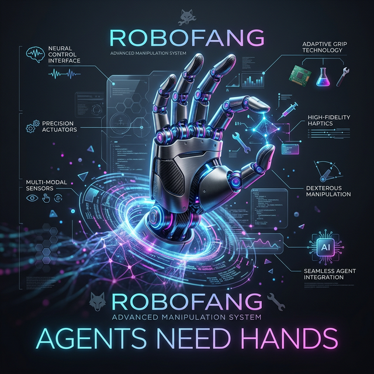
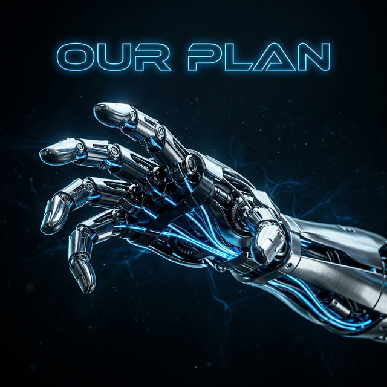
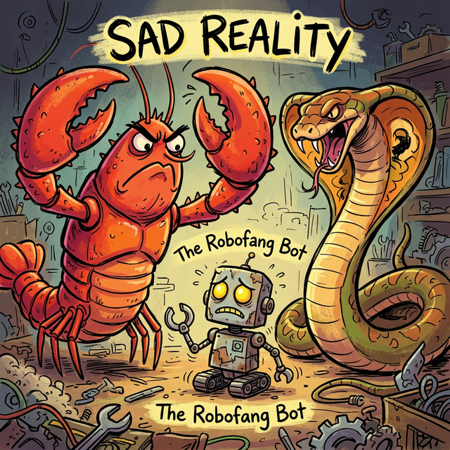
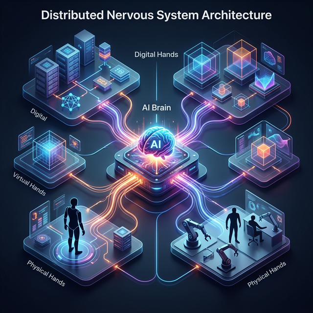

# Robofang: The Sovereign Substrate 🍌

<p align="center">
  
</p>

<p align="center">
  
  
  
  
  
  
</p>

> [!IMPORTANT]
> **Robofang** is more than just another framework; it is a fundamental shift in how we think about Artificial Intelligence. It operates on a single, uncompromising premise: **Agents Need Hands.**

## Expectation vs Reality

````carousel

<!-- slide -->

````

> [!TIP]
> ### 🍌 Agentic Banana: Low-Hanging Agency
> Getting started with Robofang is a "low-hanging fruit." Clone the substrate, pick your hands, and enable agency in under 5 minutes. No monolithic setup, just quick potassium-rich progress.

## The Vision: Beyond the Chatbox

<p align="center">
  
</p>

For too long, our interaction with AI has been confined to a text-based "chatbox." We ask questions, and we get answers. But true utility—true intelligence—requires the ability to interact with the world. Whether that world is digital, virtual, or physical, an agent without the means to effect change is merely a spectator. 

Robofang provides the "substrate" where agency is materialized. It represents the transition from AI as a service to AI as an actor. We don't just want to weed your inbox; we want to give our agents the dexterity to navigate your digital life, the creativity to build in virtual spaces, and the physicality to interact with your physical home.

## The Three Levels of Agency

Robofang orchestrates agency across three distinct, hierarchical levels of "Hands":

1.  **Digital Hands (The Fleet)**: Using the Model Context Protocol (MCP), Robofang commands a fleet of specialized servers. These are the "second level hands" that handle the heavy lifting of digital life—from sophisticated email management and Discord orchestration to controlling your smart home via Hue and Home Assistant.
2.  **Virtual Hands (The Simulation)**: Agents must be able to create and simulate. Robofang integrates a full virtualization pipeline, connecting the agent to tools like Blender, GIMP, and Unity3D. This allows the agent to build environments, manage avatars, and test physical logic in high-fidelity simulations before taking action in the real world.
3.  **Physical Hands (The Reality)**: This is the ultimate goal. Through a sophisticated ROS/OSC bridge, Robofang connects to physical robotics hardware. Whether it's learning the ropes with a Yahboom Raspbot or performing complex tasks with the Noetix Bumi humanoid, our agents are learning to touch reality.

## The Smorgasbord of Features

Robofang is a "behemoth" by design. It inherits the robust communication features of **OpenClaw** and layers on a massive smorgasbord of media and generation capabilities. 

You get deep integration for **media consumption** (Plex, Calibre, Immich) so your agent knows what you've read and watched. You get **media generation** capabilities, allowing your agent to use Blender or Inkscape to produce professional assets. And you get a **virtualization pipeline** that bridges the gap between social spaces like VRChat and industrial tools like Unity3D.

## Exploring the Behemoth

To understand how to deploy and use Robofang, please follow our hierarchical documentation hub:

-   [**Installation Guide**](docs/INSTALLATION.md): A detailed, step-by-step walkthrough on how to set up the environment and onboard your first MCP "Hands."
-   [**Technical Stack**](docs/TECHNICAL.md): A deep dive for engineers on our FastAPI core, the orchestration logic, and our modular plugin system.
-   [**MCP Fleet Catalog**](docs/MCP_FLEET.md): A comprehensive list of the digital hands currently available and the ones we have in the pipeline.
-   [**Robotics Profile**](docs/ROBOTICS.md): Our strategy for physical agency, detailing our hardware choices from the entry-level Yahboom to our humanoid champion, the Noetix Bumi.

## Join the Sovereign Grid 🍌

Robofang is a community-driven substrate. Join our Discord to share your "Hands," discuss cognitive architectures, or just show off your latest level-3 agency milestones.

<p align="center">
  <a href="https://discord.gg/robofang">
    
  </a>
</p>

---

*Handcrafted in Vienna. Built for the era of sovereign, high-agency intelligence.*
