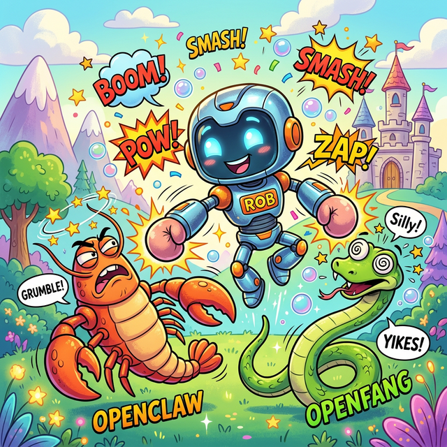
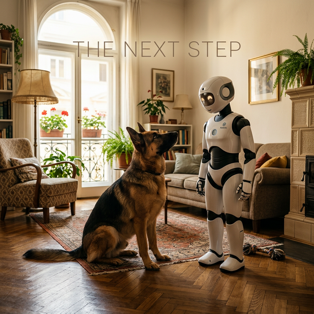

<h1 align="center">robofang</h1>

<p align="center">
  <strong>Your AI. Your hardware. Your data. Nobody else's.</strong><br>
  Sovereign agentic orchestration — with hands, legs, senses, and a voice.
</p>

<p align="center">
  
  
  
  
  
  
</p>

---

## The problem with 2026 AI agents

Every major cloud agent — Manus, Gemini Live, Claude computer use — shares the same architecture: your intent, their infrastructure, their data retention, their pricing model, their uptime SLA, their safety filter between you and your own tools.

They are impressive. They are also not yours.

Robofang is the alternative: a locally-running orchestration layer where **you** are the architect, the inference runs on your hardware at zero per-token cost, and the agent has genuine reach into the physical and virtual world — not just a browser tab.

---

## What it actually does

The core loop:

```
Perceive (senses) → Reason (Council) → Act (hands + legs) → Speak (voice) → Audit → Memory
```

Running on your machine:

- **Council of agents** (Foreman / Labor / Satisficer) handles complex tasks with adversarial self-auditing — no single black-box LLM call, no hallucination without a trace
- **Live fleet map** of every MCP server you run: tool schemas, ports, health signals — queryable by agents, visible in the hub at `localhost:10870`
- **Local inference** via Ollama (RTX 4090 — Llama 3.3 70B, Qwen 2.5 32B at zero per-token cost); cloud is the fallback, not the default
- **Resonite + OSC bridge** for 30 Hz joint control of virtual avatars — the same code path that bridges to physical robots via ROS 2
- **Persistent memory** (ADN / memops): every decision, sensor reading, and reasoning step is logged and queryable; agents remember across sessions

---

## The five capabilities (Hands, Legs, Senses, Voice, Memory)

> *"Agents Need Hands"* — [steipete](https://steipete.com/)

Hands were the start. A complete agent needs more:

| Capability | Tier | What it covers |
|------------|------|----------------|
| **Hands** | SimpleHands → AppHands | File ops, code execution, MCP fleet (email, Discord, Hue, Tapo, Plex, Calibre, Ring...) |
| **Legs** | FlowHands → RoboHands | Multi-step workflows, ROS 2 locomotion, Resonite avatar embodiment, Yahboom / Noetix Bumi hardware |
| **Senses** | Perception layer | OSC telemetry, camera feeds, Home Assistant sensors, IoT state, VLM vision via MCP bridges |
| **Voice** | Speech bridge | TTS/STT via local or cloud models, Resonite ProtoFlux audio, ElevenLabs / Hume integration |
| **Memory** | ADN substrate | Persistent knowledge graph (memops), Forensic Trace logs, semantic RAG across all sessions |

Each layer is independent and MCP-addressable. You can run just the fleet manager, or the full embodied loop.

---

## Quick start

```powershell
git clone https://github.com/sandraschi/robofang
cd robofang
python -m venv .venv
.\.venv\Scripts\activate
pip install -e .
copy .env.example .env   # fill in your credentials
cd robofang-hub; npm install; npm run build; cd ..
.\start_all.ps1
# Hub: http://localhost:10870
```

**Tailscale / LAN access:** The bridge defaults to `127.0.0.1` (localhost only). To reach it from another device by hostname (e.g. `http://goliath:10871` with goliath a Tailscale machine name), set `ROBOFANG_BRIDGE_HOST=0.0.0.0` before starting so it listens on all interfaces. Tailscale encrypts and authenticates; avoid exposing the port to the wider internet.

---

## Architecture

<p align="center">
  
</p>

> [!TIP]
> **See it in action**: We recommend checking out the `robofang-hub` dashboard at `localhost:10870` after startup to see real-time fleet discovery in motion.

The Council pattern — Foreman (architect) → Labor (executor) → Satisficer (auditor) — maps directly onto Karl Friston's sensorimotor loop: perceive, predict, act, update. Not as a metaphor. As an engineering constraint. The Satisficer exists because unchecked ReAct loops hallucinate. The Forensic Trace exists because you should be able to see exactly why your agent did what it did.

---

## Expectation vs Reality

| **THE EXPECTATION** | **THE REALITY** |
| :---: | :---: |
|  |  |

---

## The philosophy: Human as Sovereign

In the current industry default, the human is a prompt engineer — a data source for someone else's oracle.

In the Robofang architecture, **the Human is the Master of Puppets.** The agent is the **Loyal Guardian** — think Benny, our German Shepherd. Its job is dexterity in service of human intent. The human sets strategy. The agent handles execution across digital, virtual, and physical substrates.

<p align="center">
  
  <br>
  <em>The Robofang Bros: Harmonious co-operation between Benny and Bumi.</em>
</p>

---

### Current Roadmap

- [x] **Core Substrate**: FastMCP 3.x integration and Council pattern.
- [x] **Fleet Discovery**: Automated MCP server mapping and health monitoring.
- [x] **Virtual Embodiment**: Resonite + OSC 30Hz joint control.
- [/] **Physical Hands**: ROS 2 bridging for Yahboom and Noetix Bumi.
- [ ] **Sovereign Voice**: Local ElevenLabs-style TTS/STT via RTX 4090.
- [ ] **Multi-Agent Memory**: ADN graph persistence across reset cycles.

---

## Documentation

- [**Installation Guide**](docs/INSTALLATION.md): Environment setup and first-hand onboarding
- [**Architecture**](docs/ARCHITECTURE.md): Council of Dozens, memory substrate, federation mesh
- [**MCP Fleet Catalog**](docs/MCP_FLEET.md): Available digital hands and the pipeline ahead
- [**Robotics Profile**](docs/ROBOTICS.md): Hardware strategy — Yahboom entry level to Noetix Bumi humanoid
- [**Technical Stack**](docs/TECHNICAL.md): FastAPI / FastMCP 3.x core, orchestration logic, plugin system

---

## Join the Grid

<p align="center">
  <a href="https://discord.gg/robofang">
    
  </a>
</p>

### Why Star? ⭐

If you believe that the era of "Cloud Oracle" AI is a dead end—and that true intelligence requires **dexterity, sovereignty, and local hardware**—join the grid. 

Robofang is built for the developers who want to own their substrate. Every star helps us signal to the hardware community that there is a demand for open, agentic robotics.

---

---

*Handcrafted in Vienna. Built for the era of high-agency intelligence.*
