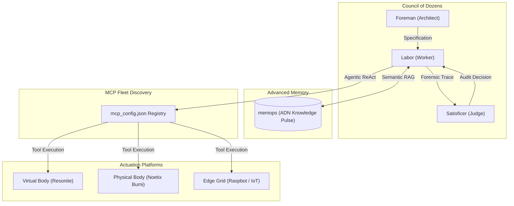

# RoboFang: System Architecture

**Document Status**: Baseline Architecture (2026-03)  
**Philosophical Core**: Materialist Reductionism

---

## 1. High-Level Design Topology

RoboFang is an **Agentic AI Orchestrator** designed for SOTA physical and virtual agency. It is built as a federated mesh of sensors, actuators, and reasoning engines, all communicating through the Model Context Protocol (MCP).

## 2. Core Operational Pillars

### 2.1 The Materialist Substrate
RoboFang treats data as the only objective reality. There are no "vibes" that cannot be converted into structured, queryable data nodes in the **Advanced Memory (ADN)**. Every interaction, sensor reading, and reasoning step is logged as a physical trace in the system's persistent memory pool.

### 2.2 Functional Sentience Loop
We eschew the "Artificial General Intelligence" (AGI) label in favor of **Functional Sentience**. This is defined as a recursive feedback loop:
1. **Perceive**: Ingest environment data (OSC, REST, Vision).
2. **Predict**: Form expectations based on persistent memory.
3. **Act**: Execute tool interactions via MCP.
4. **Update**: Minimize prediction error by updating the world model.

### 2.3 Council of Dozens: Adversarial Orchestration
RoboFang utilizes a multi-model "Council" pattern to ensure high-density reasoning.
- **Foreman**: Decouples intent from execution. It creates a technical specification for a task.
- **Labor**: The execution agent. It performs the tool-calling work.
- **Satisficer**: The quality gate. It performs an adversarial audit of the Labor agent's reasoning (the Forensic Trace) to prevent hallucinations.

## 3. Communication & Synchronization

### 3.1 Transport Layers
- **MCP (stdio/SSE)**: Primary command layer for agentic tool use.
- **OSC (Open Sound Control)**: Ultra-low latency real-time telemetry and joint control.
- **REST/WebSockets**: High-level API interactions and dashboard synchronization.

### 3.2 Security & Safety
RoboFang implements a "Sovereign Execution" model. All high-risk tasks (code execution, file system mutation) are performed within isolated sandboxes (Docker, Sandboxie-Plus) or require explicit human "Sentinel" approval through the `robofang_safety` guard.

---
*True intelligence is the reduction of environmental entropy.*
