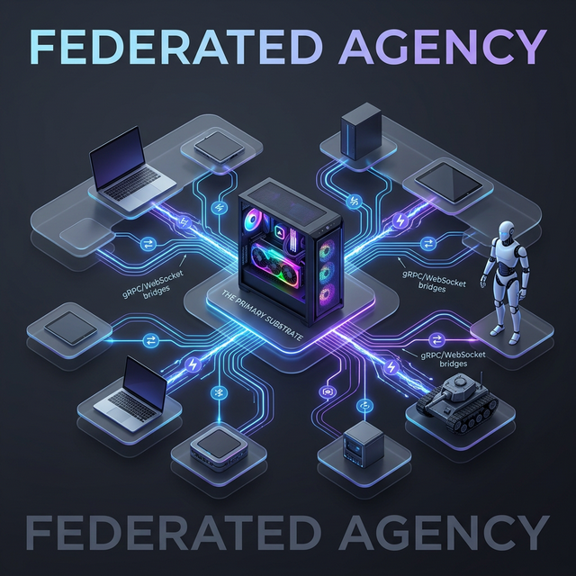

# Robofang Federation: The Distributed Nervous System

  

As the fleet of "Hands" expands, the constraints of a single physical substrate become an empirical reality. While a 4090 and 24-core Ryzen provide a massive head-start, the ultimate vision for Robofang is **Federated Agency**.

## The Pathway to Scale

### 1. Distributed Substrate
Instead of managing all MCP servers on one machine, Robofang will support a distributed model where "Satellite Substrates" can be deployed on other PCs across the local network.

### 2. Networked Orchestration
The central Robofang Core will communicate with Satellite Substrates via a secure, high-speed bridge (gRPC or optimized WebSockets), allowing it to trigger "Hands" that are physically located on other hardware.

### 3. Load Balancing & Resource Awareness
The Orchestrator will become "Network-Aware," intelligently routing tasks to the machine with the most available VRAM/CPU capacity. An AI-generating task might be routed to the 4090 beast, while a simple Discord connector runs on a low-power Raspberry Pi.

### 4. Zero-Trust Mesh
All inter-PC communication will be protected by a Zero-Trust architecture, ensuring the sovereign integrity of the Robofang ecosystem across all physical nodes.

---
*Federation is the final step in moving from a single bot to a high-availability agentic grid.*
