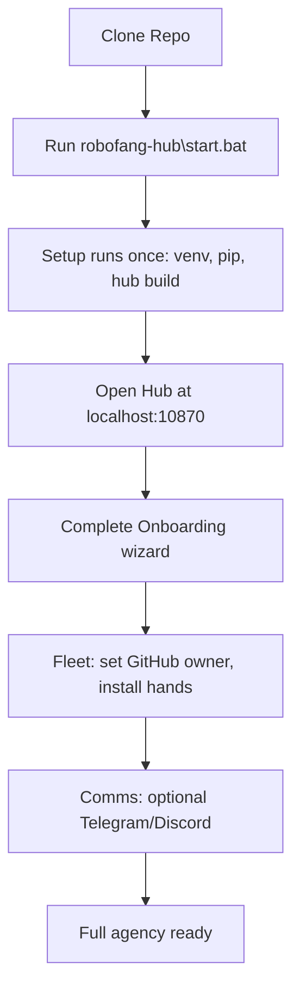

# Installation and Onboarding



## 1. Install and start

No manual config file editing. Clone, run one script, then configure everything in the web app.

**Steve just cloned the repo — what now?**

1. Open a terminal in the repo root.
2. Run: `.\robofang-hub\start.bat` (or `.\start_all.ps1` from root). First run runs setup (venv, pip install, hub build, .env from example); then the bridge and hub start.
3. Open **http://localhost:10870** in a browser. If the hub says "Bridge not ready yet", wait 60–90 s and click Retry.
4. Complete the **Onboarding** wizard: set GitHub owner for the fleet catalog, install any MCP hands you want, optionally add Telegram/Discord.
5. Use **Dashboard**, **Fleet**, **Chat**, and **Settings** from the hub. No config files to edit.

Optional: install [just](https://just.systems) and run `just` to see tasks (test, build, run, etc.). See [JUST.md](JUST.md).

```powershell
git clone https://github.com/sandraschi/robofang
cd robofang
.\robofang-hub\start.bat
```

(Or from repo root: `.\start_all.ps1` — it runs setup if needed, then the same hub start.)

First run: if you use root `.\start_all.ps1` or `.\start.bat`, setup runs automatically. Otherwise run `.\setup.ps1` once from repo root (creates `.venv`, ensures pip, `pip install -e .`, copies `.env.example` to `.env` if missing, builds the hub). Then start the bridge and hub with `.\robofang-hub\start.bat` or `.\start.bat`.

Open **http://localhost:10870** in your browser. The bridge can take **60–90 seconds** to be ready after first start. If the hub shows **"Bridge not ready yet"**, wait a moment and click **Retry**.

## 2. Configure in the hub (no .env required)

All user-facing configuration is in the **Onboarding wizard** and **Settings** in the hub. You do not need to hand-edit `.env` or any config files.

- **Fleet (Onboarding)**  
  Set **GitHub owner** (e.g. `sandraschi`) for the catalog and installs. Choose which MCP servers to install; they are cloned into `.\hands\` by default.

- **Comms (Onboarding, optional)**  
  If you want alerts or commands via Telegram or Discord, enter them in the Comms step. Telegram: bot token from [@BotFather](https://t.me/BotFather), chat ID from [@userinfobot](https://t.me/userinfobot). Discord: webhook URL from Server Settings → Integrations → Webhooks. You can skip and set later in Settings.

- **Settings**  
  Fleet (GitHub owner), LLM, and Comms can be changed anytime under Settings.

Optional: you can override or set values via `.env` (e.g. for headless or automation). See `.env.example` for variable names. The wizard and Settings are the intended way for normal use.

## 3. Safe startup

**Safe start is the default.** MCP servers (Python processes) can start; their **webapps** (Node/Vite) are not started automatically to avoid exhausting RAM.

- Start **robofang** with `.\robofang-hub\start.bat` (or `.\start_all.ps1` from repo root). Confirm the hub at http://localhost:10870 and supervisor at :10872.
- Start other MCP servers or webapps **one by one or in small batches** from the hub, with a short pause between batches.

## 4. After onboarding

- **Dashboard** — One clear next step (run setup wizard or open Fleet page). No config files.
- **Fleet page** — Your installed MCP servers: status, launch web apps, install more from the catalog.
- **Settings** — LLM (Ollama/API), optional Telegram/Discord, and other options.
- **Chat** — Talk to the agent; it uses your fleet and hands.

## 5. How to start RoboFang and give it commands

**Start:** Run `.\robofang-hub\start.bat` (or `.\start_all.ps1` from repo root) and open **http://localhost:10870** in your browser. Use the hub for all configuration and control.

**Give commands in two ways:**

- **From the webapp (primary)**  
  In the hub, open **Chat** (Neural Interface). Type your message and send. The hub calls the bridge `POST /ask`; the agent (and optional Council) runs and the reply appears in the chat. Toggle **Council Active** for multi-agent reasoning.

- **From Telegram (inbound)**  
  If you configured Telegram in Onboarding/Settings (bot token + chat ID), you can also command RoboFang by messaging your bot. Set the bot’s **webhook** to your bridge URL: `https://<your-host>/hooks/telegram` (e.g. via Tailscale or a tunnel; Telegram requires HTTPS). When a user sends a message to the bot, the bridge receives it, runs the same processing as `/ask`, and replies in that Telegram chat.

**Discord:** The Discord URL you set in Onboarding is a **webhook** (outbound only). RoboFang can send alerts or replies to that channel. To *receive* commands from Discord you would run a separate Discord bot that forwards messages to the bridge (e.g. `POST /hooks/inbox` with `reply_to: "discord"`).

## 6. If the bridge fails to start

When you run `start.bat`, the script waits up to 50s for the bridge. If it never responds, the script prints **FAILED** and shows the last 50 lines of `temp\bridge_stdout.log` (bridge crash/traceback) and the last 20 lines of the supervisor stderr log. Fix the error (e.g. missing dependency, port in use, Ollama down), then run `start.bat` again. To run the bridge in the foreground and see the traceback directly, from repo root run `.\run_bridge_console.bat`.

## 7. MCP servers that wrap an app

Many MCP servers control an external application (e.g. Blender, GIMP, Calibre, Plex). In the **Onboarding** catalog and on the **Fleet page**, each such server shows **"Requires &lt;App&gt; installed"** with a **Get &lt;App&gt;** link to the official download or install page. Install the app on your machine if you want that MCP server to work; the link is there so you are not left guessing.

*Zero-friction deployment: clone, start, complete the wizard. No config files to edit.*
