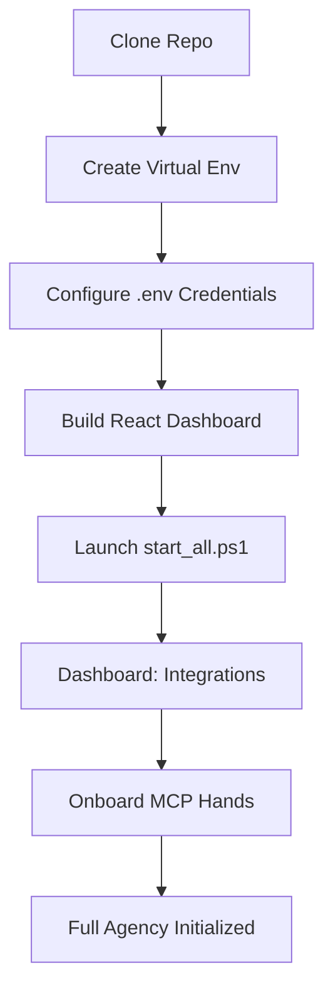

# Installation & Onboarding 🍌



### 1. The Core Substrate
First, clone the repository and set up your asynchronous environment.

```powershell
cd robofang
python -m venv .venv
.\.venv\Scripts\activate
pip install -e .
```

### 2. Configuration & Credentials
Robofang is a high-agency tool, and as such, it requires access to your various digital platforms. You will need to populate a `.env` file with your API keys and configuration secrets. We provide a `.env.example` as a template to get you started.

### 3. Building the Dashboard
The visual heart of Robofang is its Lite-based React dashboard. You will need to build the production assets before launching the server.

```powershell
cd dashboard
npm install
npm run build
cd ..
```

## Launching the Behemoth

Once your environment is prepared, you can launch the entire ecosystem with a single command. The `start_all.ps1` script is the orchestrator of our local services, ensuring that the backend, the RAG store, and the dashboard are all synchronized and ready for action.

```powershell
.\start_all.ps1
```

## Onboarding Your First Hands

After launch, you can access the dashboard at `http://localhost:10864`. This is where the real work begins—onboarding your "Digital Hands."

1.  Navigate to the **Integrations** panel in the dashboard.
2.  Here, you can discover and register new MCP servers. Whether you are adding a professional tool like ArXiv or a home automation bridge like Philips Hue, the process is zero-friction.
3.  Use the built-in **Ping Test** to verify that the agent can successfully reach out and "touch" the hand you've just enabled.

---
*Zero-friction deployment is a prerequisite for sovereign intelligence.*
