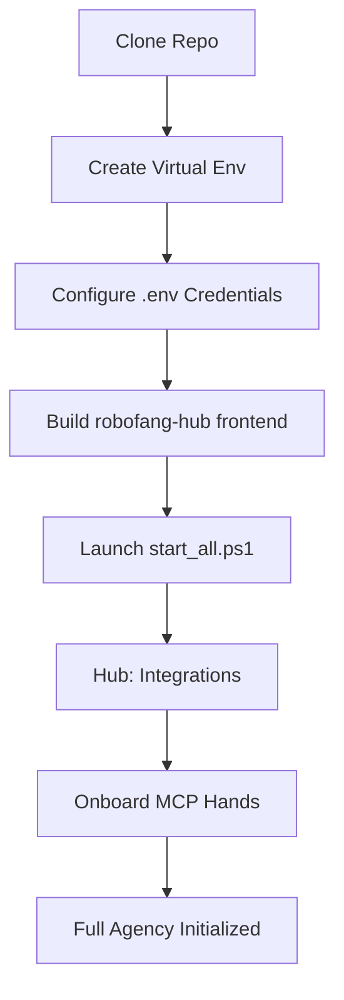

# Installation & Onboarding 🍌



### 1. The Core Substrate
First, clone the repository and set up your asynchronous environment.

```powershell
cd robofang
python -m venv .venv
.\.venv\Scripts\activate
pip install -e .
```

### 2. Configuration & Credentials
Robofang is a high-agency tool, and as such, it requires access to your various digital platforms. You will need to populate a `.env` file with your API keys and configuration secrets. We provide a `.env.example` as a template to get you started.

### 3. Building the frontend (robofang-hub)
The UI is the **robofang-hub** React app. (The legacy `dashboard` directory is deprecated.) Build production assets before launching:

```powershell
cd robofang-hub
npm install
npm run build
cd ..
```

## Launching the Behemoth

Once your environment is prepared, you can launch the entire ecosystem with a single command. The stack (supervisor, bridge, hub) is then **ready for configuration**: MCP servers (Fleet / Installer or Onboarding), LLM (Settings), and auth/comms (Onboarding).

- **PowerShell:** `.\start_all.ps1`
- **Batch (double-click or cmd):** `start.bat` (calls `start_all.ps1`)

Hub: http://localhost:10870 — use Onboarding, Fleet/Installer, and Settings to configure MCP, LLM, and auth.

### Safe startup (default)

**Safe start is the default.** MCP servers (Python processes) can start en masse; their **webapps** (Node/Vite dev servers) cannot—each webapp is memory-heavy. Do not start robofang and the entire webapp fleet in one go, or you risk exhausting RAM and a full lockup.

- **Default:** Start **robofang only** first (`.\start_all.ps1`). Confirm the hub at http://localhost:10870 and supervisor at :10872 are up. Then start other MCP servers or webapps **one by one or in small batches**, with a short pause between batches (e.g. 30–60 seconds).
- Any fleet-wide launcher **must** default to safe/staged start (minimal set or batched with delays). "Full fleet at once" should be opt-in only (e.g. an explicit `-Full` or `-Unsafe` flag).

## Onboarding Your First Hands

After launch, you can access the hub at `http://localhost:10870`. This is where the real work begins—onboarding your "Digital Hands."

1.  Navigate to the **Integrations** panel in the hub.
2.  Here, you can discover and register new MCP servers. Whether you are adding a professional tool like ArXiv or a home automation bridge like Philips Hue, the process is zero-friction.
3.  Use the built-in **Ping Test** to verify that the agent can successfully reach out and "touch" the hand you've just enabled.

---
*Zero-friction deployment is a prerequisite for sovereign intelligence.*
