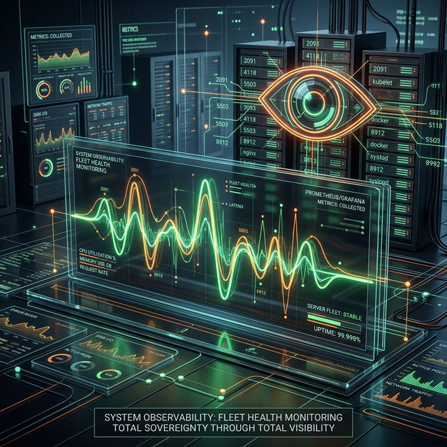

# The MCP Fleet: Digital Hands 🍌

  

Each "Hand" in the Robofang fleet is a specialized MCP server designed for deep, state-of-the-art orchestration.

## Active Hands

### 🍌 Media Consumption (The Knowledge Banana)
- **Plex Hand**: Real-time media search, playback control, and RAG-integrated metadata analysis.
- **Calibre Hand**: Bibliographic agency. Your agent becomes if the ultimate librarian, capable of managing knowledge across thousands of volumes.

### 🍌 Creative Power (The Design Banana)
- **Blender Hand**: 3D agency. From geometry generation to procedural scene orchestration. 
- **GIMP Hand**: Advanced image manipulation and visual asset generation.
- **SVG Hand**: Mathematical precision in vector graphics.

### 🍌 Infrastructure (The Substrate Banana)
- **RustDesk Hand**: Remote substrate navigation. Grant your agent access to manage remote physical nodes.

## Planned Hands
- **Discord Hand**: Social orchestration and community agency.
- **D-Bus/System Hand**: Deep OS-level intervention for Linux satellites.
- **Philips Hue Hand**: Physical environmental agency (Lighting).

---
> [!IMPORTANT]
> ### 🍌 The Potassium Principle
> We prioritize "High-Potassium" hands—tools that provide the most agency with the least friction. If a hand doesn't drastically improve the orchestrator's ability to "act" in the world, it's not a Robofang hand.
