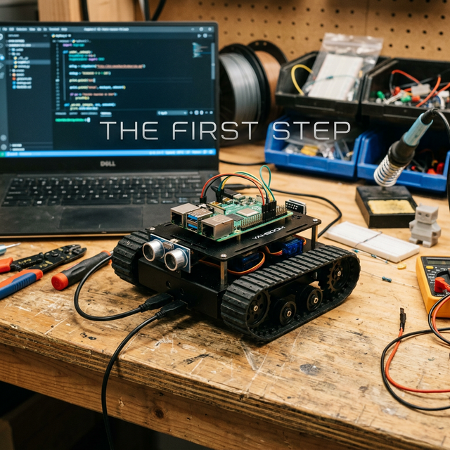
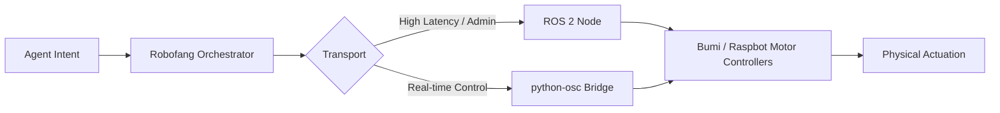

# Robofang: Physical Hands (Robotics)

  

The name "Robofang" is an intentional provocation. It signifies that our agents are no longer purely digital constructs; they have "bite" in the physical world. This document outlines our strategic roadmap for physical agency, detailing the hardware we trust and the software layers that bring it to life.

## The Strategy: Hierarchical Hardware

We do not believe in a one-size-fits-all approach to robotics. Instead, we follow a tiered strategy that allows for both accessible learning and high-end industrial-grade performance.

### 1. The Primary Champion: Noetix Bumi
Our current focus and most anticipated platform is the **Noetix Bumi**. Priced at approximately $1,500, it represents a remarkable breakthrough in affordable humanoid robotics. For the Robofang vision, it is the perfect "champion."

  

Unlike other consumer-grade humanoids, the Noetix Bumi features a truly open development stack based on Android and ROS (Robot Operating System). This openness is critical for us; it allows our agents to map their intentions directly into the humanoid form factor without being hampered by proprietary barriers. The Bumi is where our "Physical Hands" find their most expressive and capable outlet.

### 2. The Learning Foundation: Yahboom (Raspbot v2)
Every major journey begins with a first step, and for many Robofang users, that step is the **Yahboom Raspbot v2**. Starting at just $100, this platform is an incredible accessible entry point into the world of agentic robotics.

  

We consider the Yahboom essential for the "learning" phase of the project. It provides an excellent sandbox for testing vision-based tracking using OpenCV, basic SLAM navigation, and simple agentic intentions. Before an agent attempts to manipulate a humanoid robot, it learns the fundamentals of spatial awareness and physics on a Raspbot.

### 3. Deemphasized: The Unitree Ecosystem
While we acknowledge the technical prowess of the **Unitree** lineup, we have deliberately deemphasized their platforms in the current iteration of Robofang. The primary reason is the high barrier to entry—specifically the price of their "Edu" models, which are required for full development access. 

The lower-cost consumer models in the Unitree stack often come with closed or restricted software layers that are fundamentally incompatible with the Robofang vision of a sovereign, open substrate. Until their open stack becomes more accessible, we choose to focus our energy elsewhere.

## The Reach: Software Integration

Physical agency is not just about the hardware; it's about the communication layer. Robofang bridges the gap between the agent's "mind" and its "hands" using:

-   **ROS (Robot Operating System)**: The industry standard that allows our Python-based orchestrator to talk to nearly any modern robot.
-   **python-osc**: This provides ultra-low latency, real-time synchronization. It allows an agent to maintain a "digital twin" in Unity3D while its physical hands are moving in reality.
-   **Standardized Hand Plugins**: We are developing a library of plugins that standardize how agents approach navigation, grasping, and environmental perception.

### The Bridge: Logic Flow

---
*True intelligence is measured by its impact on the physical world. We are building the reach.*
