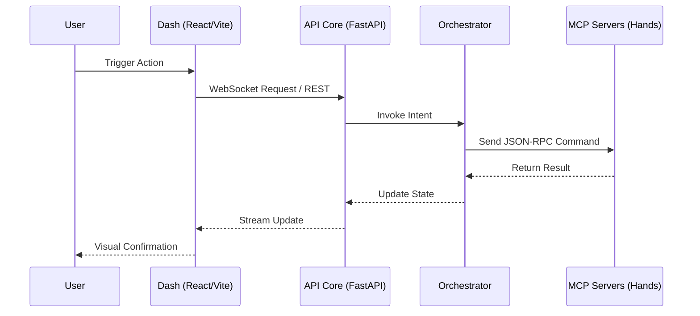

# Robofang: Technical Stack & Architecture

Robofang is professionally engineered for speed, resilience, and maximum agency. It is a "behemoth" of capability, yet it remains nimble and responsive thanks to its modern, asynchronous architecture. This document provides a deep dive into the technology that powers our substrate.

## The Foundation: Core Technologies

We have carefully curated a stack that balances ease of development with high-performance execution.

-   **Backend (Python)**: We leverage **Python 3.12+** for its rich ecosystem and unparalleled suitability for AI and robotics. **FastAPI** serves as our primary web framework, providing high-performance, asynchronous endpoints that can handle the concurrent demands of an agentic fleet.
-   **Frontend (React/Vite)**: Our dashboard is built using **Vite** and **React**. This ensures a fast, reactive user interface that feels like a premium, state-of-the-art instrument.
-   **Data Storage (LanceDB)**: For our Retrieval-Augmented Generation (RAG) system, we use **LanceDB**. This allows us to maintain a high-performance vector store locally, enabling agents to have a "persistent memory" of your media library and technical documentation without the latency of cloud-based solutions.

## The Architecture of Agency

Robofang is organized into a modular hierarchy designed for sovereign, multi-domain orchestration.

### 1. The Core Substrate (FastAPI)
The central nervous system. It handles authentication, state management, and the high-level orchestrator logic.

### 2. The Orchestrator & Installer
The bridge between intent and capability. The **Installer** utilizes the `fleet_manifest.yaml` to discover available "Hands" and performs lazy-cloning of MCP repositories into the local environment upon user request.

### 3. The Plugin System (MCP 3.1)
Digital hands are implemented as MCP servers. Each server acts as a specialized tool for the orchestrator, whether it's managing a Plex library or controlling a robotic limb.

### 4. The RAG Bridge
The **Robofang RAG** system provides the semantic bridge between the agent and the massive amounts of data in your ecosystem. By indexing media content and technical docs, it allows the agent to provide contextually relevant actions. If you ask an agent about a book in your Calibre library, it doesn't just know it exists—it can "remember" the core themes and provide intelligent summaries.

---
*Materialist engineering for sovereign agents. Every line of code is a step toward physical agency.*
